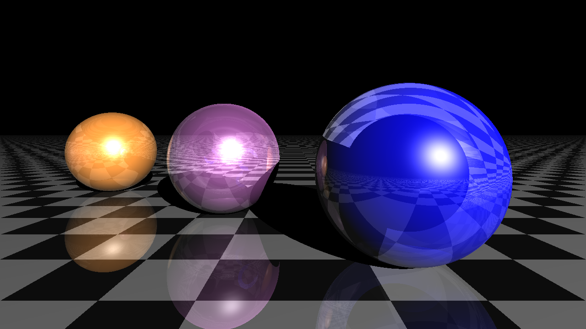

# raytracing

Very simple ray tracing engine in (almost) pure Python. Depends on NumPy and Matplotlib. Diffuse and specular lighting, simple shadows, reflections, no refraction. Purely sequential algorithm, slow execution.

[Original code](https://gist.github.com/rossant/6046463).

## Grabbing the code
```
git clone https://github.com/...
```

## Setup requirements
Install all requirements:
```
pip install -r requirements.txt
```

## Running application
```
python raytracing.py
```

## Result picture


